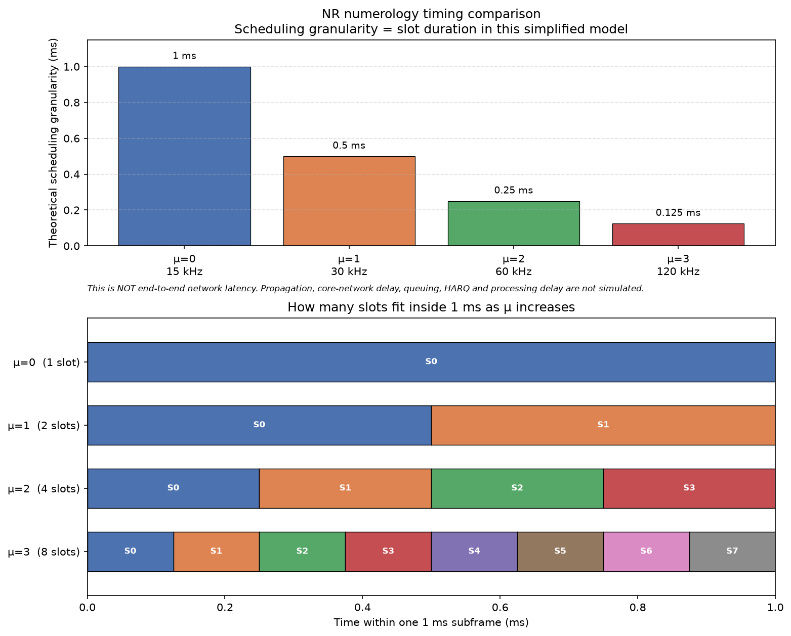
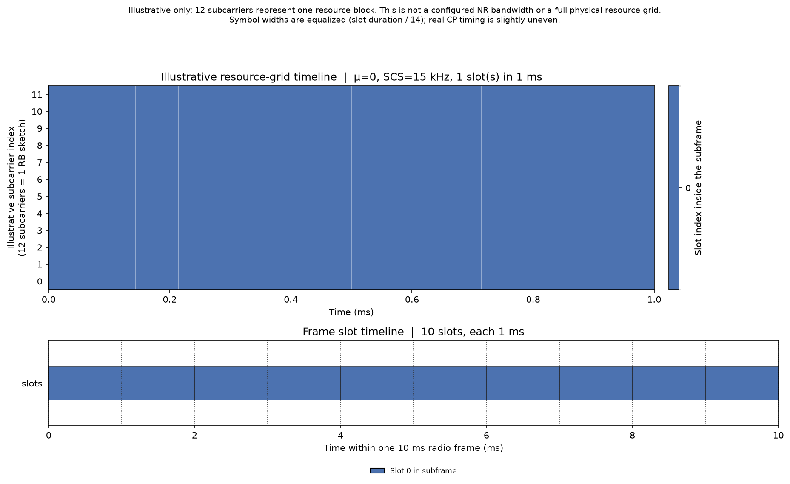
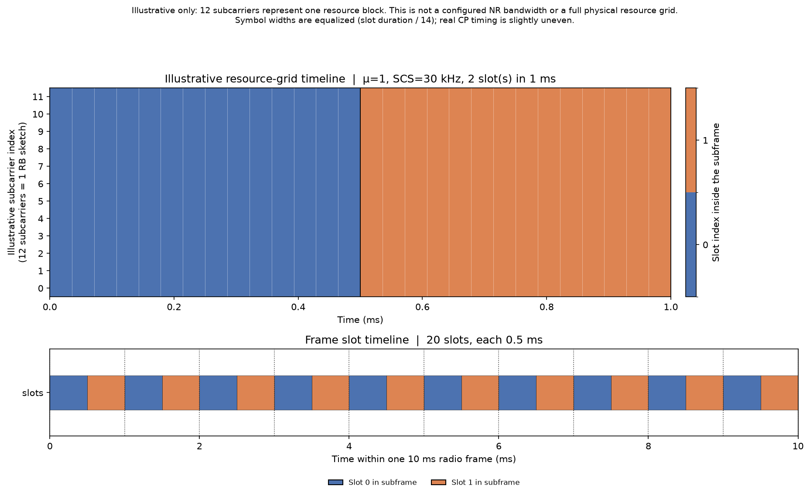
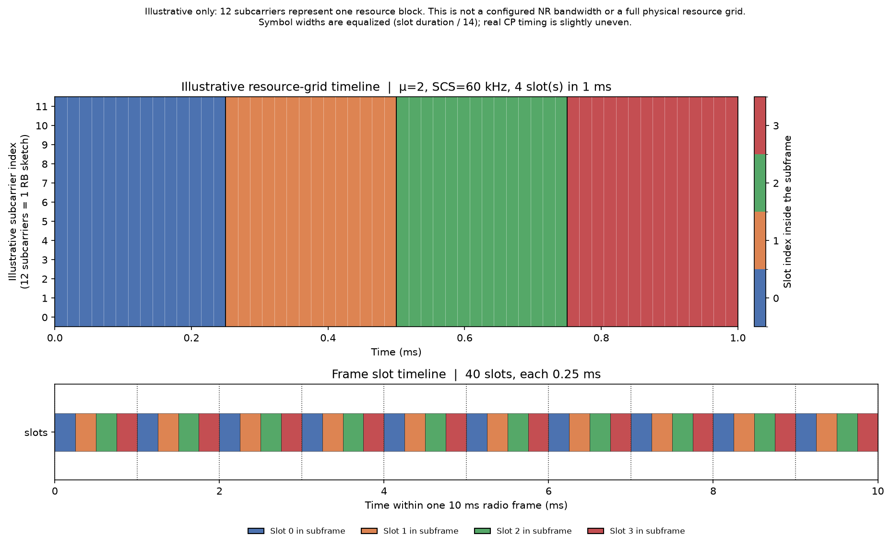
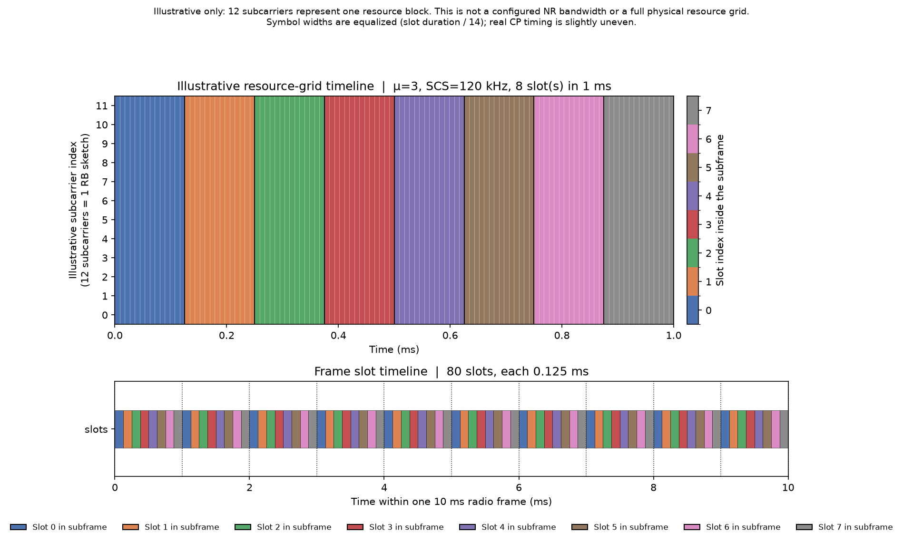

# 5G NR Numerology and Frame-Structure Simulator (SCS, Slot and Symbol Timing)

Python calculator-simulator for 5G NR numerology. It applies the 3GPP SCS, slot, and frame-structure relationships for μ = 0, 1, 2, 3, builds a Frame → Subframe → Slot → Symbol timeline, compares theoretical scheduling granularity, and plots an illustrative resource-grid timeline.

## Contributors

- [Mohamed Irfan A](https://github.com/mohmedirfan12-dotcom)
- [Mubendiran K](https://github.com/MUBENDIRAN)

## Problem statement

NR's flexible numerology changes slot/symbol timing and latency. Build a calculator-simulator.

## Objectives

1. Implement 5G NR numerologies μ = 0, 1, 2, 3 in Python.
2. Compute subcarrier spacing (SCS).
3. Compute slot duration.
4. Compute symbols per slot.
5. Compute slots per subframe and slots per frame.
6. Compute symbol timing (equalized symbol-duration model — see assumptions).
7. Simulate the Frame → Subframe → Slot → Symbol timeline.
8. Compare timing / scheduling granularity across numerologies.
9. Plot a resource-grid timeline.
10. Produce three deliverables: numerology simulator, timing comparison, resource-grid plot.

## Technologies used

- Python 3.12 compatible (standard library for CLI, dataclasses, unittest)
- NumPy
- Matplotlib
- Pandas
- Git / GitHub
- Windows + VS Code + PowerShell

## Project structure

```
5G_NR_numerology_and_frame_structure_simulator/
├── src/
│   ├── __init__.py
│   ├── numerology.py      # formulas and validation
│   ├── timeline.py        # Frame / Subframe / Slot / Symbol dataclasses
│   ├── simulator.py       # comparison table and CSV export
│   └── visualization.py   # Matplotlib figures
├── tests/
│   ├── __init__.py
│   └── test_numerology.py
├── outputs/               # CSV and PNG files created when the program is run
├── README.md
├── requirements.txt
├── .gitignore
└── main.py                # command-line menu
```

## NR formulas used

Normal cyclic prefix is assumed throughout.

| Quantity | Formula |
| --- | --- |
| Subcarrier spacing | `SCS = 15 × 2^μ` kHz |
| Slots per subframe | `2^μ` |
| Slot duration | `1 / 2^μ` ms (subframe duration is 1 ms) |
| Slots per frame | `10 × 2^μ` (radio frame duration is 10 ms; 10 subframes) |
| Symbols per slot | `14` (normal CP) |
| Equalized symbol duration | `slot_duration / 14` |

## Numerology table

| μ | SCS (kHz) | Slots / subframe | Slot duration (ms) | Slots / 10 ms frame |
| --- | ---: | ---: | ---: | ---: |
| 0 | 15 | 1 | 1.000 | 10 |
| 1 | 30 | 2 | 0.500 | 20 |
| 2 | 60 | 4 | 0.250 | 40 |
| 3 | 120 | 8 | 0.125 | 80 |

## How to install

In PowerShell, from the project root:

```powershell
python -m venv venv
.\venv\Scripts\Activate.ps1
python -m pip install --upgrade pip
pip install -r requirements.txt
```

If script activation is blocked:

```powershell
Set-ExecutionPolicy -Scope CurrentUser RemoteSigned
```

Then run `.\venv\Scripts\Activate.ps1` again.

## How to run

From the project root, with the virtual environment active:

```powershell
python main.py
```

Menu:

```
============================================================
  5G NR Numerology and Frame-Structure Simulator
  SCS, slot and symbol timing  |  μ = 0, 1, 2, 3
============================================================
  1. Display numerology comparison
  2. Display frame timeline summary for a selected μ
  3. Generate timing comparison plot
  4. Generate resource-grid / timeline plot
  5. Export comparison table as CSV
  6. Generate all deliverable files
  0. Exit
============================================================
```

Write all deliverable files and exit:

```powershell
python main.py --export-all
```

## Example output

Values below are produced by the calculator from the formulas in this repository.

### Option 1 — Display numerology comparison

```
5G NR numerology comparison (normal cyclic prefix)
------------------------------------------------------------------------------
 mu  SCS_kHz  slot_duration_ms  symbols_per_slot  symbol_duration_us  slots_per_subframe  slots_per_frame  scheduling_granularity_ms
  0     15.0             1.000                14           71.428571                   1               10                      1.000
  1     30.0             0.500                14           35.714286                   2               20                      0.500
  2     60.0             0.250                14           17.857143                   4               40                      0.250
  3    120.0             0.125                14            8.928571                   8               80                      0.125

Scheduling granularity is the slot duration in this simplified model. It is the theoretical minimum scheduling interval, not real end-to-end 5G network latency.
Symbol duration = slot duration / 14. Real NR cyclic-prefix timing makes a few symbols slightly longer than others; this simulator uses equal symbol widths as a simplification.
```

`symbol_duration_us` is `(slot_duration_ms / 14) × 1000`.

### Option 2 — Frame timeline summary, μ = 0

```
Radio frame summary for numerology μ = 0
  SCS                      : 15 kHz
  Frame duration           : 10 ms
  Subframes in frame       : 10
  Slots in frame           : 10
  Symbols in frame         : 140
  Slot duration            : 1 ms
  Equalized symbol duration: 71.428571 us

First subframe (index 0): 0 ms to 1 ms
  Slot 0: 0.000000 .. 1.000000 ms  |  14 symbols  |  symbol 0 starts 0.000000 ms, symbol 13 ends 1.000000 ms

Last subframe (index 9): 9 ms to 10 ms
  Last slot 0 (frame slot 9): 9.000000 .. 10.000000 ms
  Last symbol ends at 10.000000 ms (must equal 10 ms)

Note: symbol durations are equalized (slot duration / 14). This is a simulation simplification, not bit-accurate CP timing.
Note: slot duration is theoretical scheduling granularity, not end-to-end network latency.

Theoretical scheduling granularity for μ=0: 1 ms
```

### Option 2 — Frame timeline summary, μ = 1

```
Radio frame summary for numerology μ = 1
  SCS                      : 30 kHz
  Frame duration           : 10 ms
  Subframes in frame       : 10
  Slots in frame           : 20
  Symbols in frame         : 280
  Slot duration            : 0.5 ms
  Equalized symbol duration: 35.714286 us

First subframe (index 0): 0 ms to 1 ms
  Slot 0: 0.000000 .. 0.500000 ms  |  14 symbols  |  symbol 0 starts 0.000000 ms, symbol 13 ends 0.500000 ms
  Slot 1: 0.500000 .. 1.000000 ms  |  14 symbols  |  symbol 0 starts 0.500000 ms, symbol 13 ends 1.000000 ms

Last subframe (index 9): 9 ms to 10 ms
  Last slot 1 (frame slot 19): 9.500000 .. 10.000000 ms
  Last symbol ends at 10.000000 ms (must equal 10 ms)

Note: symbol durations are equalized (slot duration / 14). This is a simulation simplification, not bit-accurate CP timing.
Note: slot duration is theoretical scheduling granularity, not end-to-end network latency.

Theoretical scheduling granularity for μ=1: 0.5 ms
```

### Option 2 — Frame timeline summary, μ = 2

```
Radio frame summary for numerology μ = 2
  SCS                      : 60 kHz
  Frame duration           : 10 ms
  Subframes in frame       : 10
  Slots in frame           : 40
  Symbols in frame         : 560
  Slot duration            : 0.25 ms
  Equalized symbol duration: 17.857143 us

First subframe (index 0): 0 ms to 1 ms
  Slot 0: 0.000000 .. 0.250000 ms  |  14 symbols  |  symbol 0 starts 0.000000 ms, symbol 13 ends 0.250000 ms
  Slot 1: 0.250000 .. 0.500000 ms  |  14 symbols  |  symbol 0 starts 0.250000 ms, symbol 13 ends 0.500000 ms
  Slot 2: 0.500000 .. 0.750000 ms  |  14 symbols  |  symbol 0 starts 0.500000 ms, symbol 13 ends 0.750000 ms
  Slot 3: 0.750000 .. 1.000000 ms  |  14 symbols  |  symbol 0 starts 0.750000 ms, symbol 13 ends 1.000000 ms

Last subframe (index 9): 9 ms to 10 ms
  Last slot 3 (frame slot 39): 9.750000 .. 10.000000 ms
  Last symbol ends at 10.000000 ms (must equal 10 ms)

Note: symbol durations are equalized (slot duration / 14). This is a simulation simplification, not bit-accurate CP timing.
Note: slot duration is theoretical scheduling granularity, not end-to-end network latency.

Theoretical scheduling granularity for μ=2: 0.25 ms
```

### Option 2 — Frame timeline summary, μ = 3

```
Radio frame summary for numerology μ = 3
  SCS                      : 120 kHz
  Frame duration           : 10 ms
  Subframes in frame       : 10
  Slots in frame           : 80
  Symbols in frame         : 1120
  Slot duration            : 0.125 ms
  Equalized symbol duration: 8.928571 us

First subframe (index 0): 0 ms to 1 ms
  Slot 0: 0.000000 .. 0.125000 ms  |  14 symbols  |  symbol 0 starts 0.000000 ms, symbol 13 ends 0.125000 ms
  Slot 1: 0.125000 .. 0.250000 ms  |  14 symbols  |  symbol 0 starts 0.125000 ms, symbol 13 ends 0.250000 ms
  Slot 2: 0.250000 .. 0.375000 ms  |  14 symbols  |  symbol 0 starts 0.250000 ms, symbol 13 ends 0.375000 ms
  Slot 3: 0.375000 .. 0.500000 ms  |  14 symbols  |  symbol 0 starts 0.375000 ms, symbol 13 ends 0.500000 ms
  Slot 4: 0.500000 .. 0.625000 ms  |  14 symbols  |  symbol 0 starts 0.500000 ms, symbol 13 ends 0.625000 ms
  Slot 5: 0.625000 .. 0.750000 ms  |  14 symbols  |  symbol 0 starts 0.625000 ms, symbol 13 ends 0.750000 ms
  Slot 6: 0.750000 .. 0.875000 ms  |  14 symbols  |  symbol 0 starts 0.750000 ms, symbol 13 ends 0.875000 ms
  Slot 7: 0.875000 .. 1.000000 ms  |  14 symbols  |  symbol 0 starts 0.875000 ms, symbol 13 ends 1.000000 ms

Last subframe (index 9): 9 ms to 10 ms
  Last slot 7 (frame slot 79): 9.875000 .. 10.000000 ms
  Last symbol ends at 10.000000 ms (must equal 10 ms)

Note: symbol durations are equalized (slot duration / 14). This is a simulation simplification, not bit-accurate CP timing.
Note: slot duration is theoretical scheduling granularity, not end-to-end network latency.

Theoretical scheduling granularity for μ=3: 0.125 ms
```

### Option 3 — Generate timing comparison plot

```
Saved timing comparison plot: outputs/timing_comparison.png
```

See [Generated outputs](#generated-outputs) for the figure.

### Option 4 — Generate resource-grid / timeline plot

Selecting `all`:

```
Saved resource-grid plots:
  outputs/resource_grid_mu0.png
  outputs/resource_grid_mu1.png
  outputs/resource_grid_mu2.png
  outputs/resource_grid_mu3.png
```

Selecting a single numerology (example: μ = 0):

```
Saved resource-grid plot: outputs/resource_grid_mu0.png
The 12-subcarrier axis is an illustrative resource block. It is not a configured NR bandwidth.
```

See [Generated outputs](#generated-outputs) for the four resource-grid figures.

### Option 5 — Export comparison table as CSV

```
Saved comparison table: outputs/numerology_comparison.csv
```

File contents (`outputs/numerology_comparison.csv`):

```
mu,SCS_kHz,slot_duration_ms,symbols_per_slot,symbol_duration_us,slots_per_subframe,slots_per_frame,scheduling_granularity_ms
0,15,1,14,71.42857143,1,10,1
1,30,0.5,14,35.71428571,2,20,0.5
2,60,0.25,14,17.85714286,4,40,0.25
3,120,0.125,14,8.928571429,8,80,0.125
```

### Option 6 — Generate all deliverable files

```
Generated deliverable files:
  outputs/numerology_comparison.csv
  outputs/timing_comparison.png
  outputs/resource_grid_mu0.png
  outputs/resource_grid_mu1.png
  outputs/resource_grid_mu2.png
  outputs/resource_grid_mu3.png
```

The same file list is written by `python main.py --export-all`.

## Testing instructions

From the project root:

```powershell
python -m unittest discover -s tests -v
```

Equivalent:

```powershell
python -m unittest tests.test_numerology -v
```

The tests check SCS, slot duration, 14 symbols per slot, slots per subframe/frame, invalid μ values (`-1`, `4`, `2.5`, `"two"`), the identity `slots_per_subframe × slot_duration_ms = 1 ms`, `slots_per_frame = 10 × slots_per_subframe`, and that `build_frame(mu)` tiles exactly 10 ms.

## Generated outputs

Files are written under `outputs/` when the matching menu option or `python main.py --export-all` is run. Paths are relative to the project root.

| Path | Description |
| --- | --- |
| [`outputs/numerology_comparison.csv`](outputs/numerology_comparison.csv) | Comparison table for μ = 0, 1, 2, 3 |
| [`outputs/timing_comparison.png`](outputs/timing_comparison.png) | Scheduling-granularity bar chart and 1 ms slot packing |
| [`outputs/resource_grid_mu0.png`](outputs/resource_grid_mu0.png) | Illustrative 12-subcarrier grid and 10 ms timeline, μ = 0 |
| [`outputs/resource_grid_mu1.png`](outputs/resource_grid_mu1.png) | Illustrative 12-subcarrier grid and 10 ms timeline, μ = 1 |
| [`outputs/resource_grid_mu2.png`](outputs/resource_grid_mu2.png) | Illustrative 12-subcarrier grid and 10 ms timeline, μ = 2 |
| [`outputs/resource_grid_mu3.png`](outputs/resource_grid_mu3.png) | Illustrative 12-subcarrier grid and 10 ms timeline, μ = 3 |

### `outputs/timing_comparison.png`



### `outputs/resource_grid_mu0.png`



### `outputs/resource_grid_mu1.png`



### `outputs/resource_grid_mu2.png`



### `outputs/resource_grid_mu3.png`



## Technical assumptions

- Supported numerologies are μ = 0, 1, 2, 3.
- Cyclic prefix is **normal CP** only (14 OFDM symbols per slot). Extended CP is not modelled.
- A subframe is always 1 ms. A radio frame is always 10 ms and contains 10 subframes.
- **Equal symbol duration:** `symbol_duration = slot_duration / 14`. In real NR, cyclic-prefix lengths are not identical for every OFDM symbol, so physical symbol durations differ slightly. This simulator uses equal widths so the Frame → Slot → Symbol hierarchy stays consistent. That is a simulation simplification, not bit-accurate CP timing.
- Time axes in the plots are taken from `build_frame()`, not from hardcoded millisecond lists.

## Scheduling-granularity limitation

The column `scheduling_granularity_ms` is **slot duration**. In this simulator it is the theoretical minimum scheduling interval: the shortest time unit in which the model can place a new slot.

It is **not** end-to-end 5G network latency. The program does not simulate radio propagation delay, core-network delay, queuing delay, HARQ round-trip time, or UE/gNB processing delay.

A higher μ makes slots shorter, so the scheduling grid is finer.

## Resource-grid visualization limitation

The resource-grid figure uses **12 subcarriers** on the y-axis because that is the width of one NR resource block. It is an illustration of time (x-axis) against a small frequency axis.

It does not represent a configured NR channel bandwidth, a complete physical resource grid, or actual PDSCH/PUSCH allocations, DMRS, or SSB. Slot colours come from the simulated timeline of the selected numerology.

## How the modules interact

`numerology.py` implements the formulas. `timeline.py` calls those functions and builds dataclass objects for one 10 ms frame. `simulator.py` gathers μ = 0..3 into a Pandas table and writes CSV. `visualization.py` reads the same timing objects and draws PNG files. `main.py` is the menu and does not duplicate the math.

## References

1. [3GPP TS 38.211, *NR; Physical channels and modulation*](https://www.3gpp.org/ftp/Specs/archive/38_series/38.211/) — numerology, SCS Δf = 15·2^μ kHz, normal-CP slot of 14 OFDM symbols, 10 ms radio frame / 1 ms subframe.
2. [3GPP TS 38.213, *NR; Physical layer procedures for control*](https://www.3gpp.org/ftp/Specs/archive/38_series/38.213/) — slot-based timing used as background for scheduling intervals (not implemented here).
3. [3GPP TS 38.300, *NR; NR and NG-RAN Overall description; Stage-2*](https://www.3gpp.org/ftp/Specs/archive/38_series/38.300/) — overall NR radio-interface description, including the 10 ms frame / 1 ms subframe structure.
4. [3GPP TS 38.104, *NR; Base Station (BS) radio transmission and reception*](https://www.3gpp.org/ftp/Specs/archive/38_series/38.104/) — SCS and channel-bandwidth configuration. Used here only as context that a 12-subcarrier sketch is not a configured NR bandwidth.
5. [3GPP, *5G System Overview*](https://www.3gpp.org/technologies/5g-system-overview) — public overview of the 5G radio access and core architecture.
6. [ShareTechnote, *5G/NR Frame Structure*](https://www.sharetechnote.com/html/5G/5G_FrameStructure.html) — worked explanation of NR frames, subframes, slots, and numerology.
7. [Dahlman, Parkvall, Skold, *5G NR: The Next Generation Wireless Access Technology*](https://shop.elsevier.com/books/5g-nr/dahlman/978-0-12-814323-0) — textbook treatment of numerology and frame structure.
